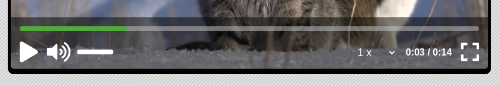

# Video Player -> [LIVE DEMO](https://shcoobz.github.io/video-player/)

## Summary

Video Player provides a custom, intuitive video player interface for web applications. It features a user-friendly control panel with play/pause, volume adjustment, playback speed control, progress tracking, and fullscreen capabilities.

The core functionality includes:

- Play/Pause toggling with a customizable button.
- Volume control with visual feedback.
- Playback speed adjustment.
- Video progress bar with seek functionality.
- Fullscreen mode for an immersive viewing experience.

## Features

### Play/Pause Toggle

Allows users to play or pause the video content with a single click, providing a seamless viewing experience.

### Volume Control

Users can adjust the volume with a slider control, including muting/unmuting functionality, ensuring optimal audio levels.

### Playback Speed Adjustment

This feature lets users change the video playback speed, making it easier to watch content at their preferred pace.

### Progress Tracking and Seeking

A progress bar displays the current playback position and allows users to jump to different parts of the video easily.

### Fullscreen Mode

Enables users to switch between fullscreen and windowed modes, offering flexibility in how they view content.

## Technologies

- HTML5: For structuring the video player and controls.
- CSS3: For styling and responsiveness of the player interface.
- JavaScript: To create interactive features such as play/pause, volume control, and fullscreen mode.
- FontAwesome: Provides icons for the player controls.

---

_Note: This document provides an overview of Video Player. For detailed instructions and more information, please refer to the source code documentation._
